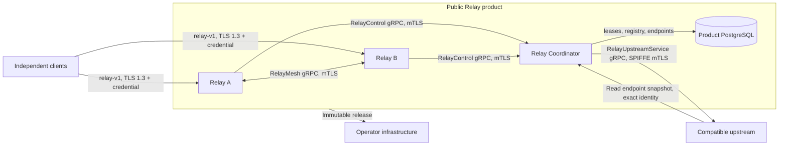
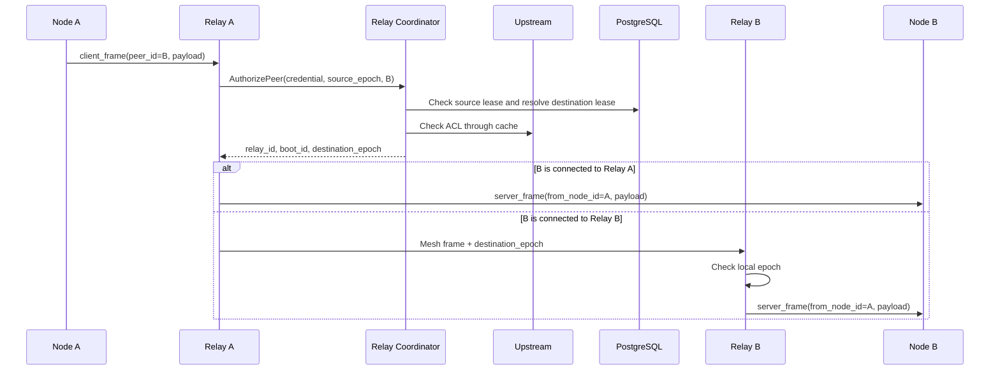

# Relay architecture

Status: standalone product architecture, updated September 7, 2026.
Implementation and CI evidence are recorded separately; accepting an architecture
does not by itself complete validation.

## 1. Purpose and boundaries

Relay forwards opaque frames between nodes in one authorized network when a
direct connection is unavailable or not selected. This repository owns two
production components:

- **Relay**: the public dataplane, client sessions and mesh connections to other
  Relay instances.
- **Relay Coordinator**: the cluster control plane, including instance registration,
  session leases and fencing, current node-owner lookup, authorization and public
  endpoint publication.

Relay is a standalone public product. A compatible upstream owns networks, nodes,
directed ACLs and signing trust. Relay Coordinator accesses it through the
[published contract](upstream-contract.md) and maintains a short-lived cache.
Integrator implementations require their own conformance validation. Building and
testing Relay does not require an integrator's sources, database, CI or production
configuration.

The product deliberately does not provide:

- A store or broker with guaranteed delivery.
- The source of truth for ACLs and node membership.
- Processing of user payload contents.
- A general-purpose L7 proxy.

## 2. System context



Payloads pass only through Relay and the relay mesh. Relay Coordinator and the
upstream receive credentials and network/node identifiers, but no user payloads.

## 3. Components

| Component | Responsibility | State |
| --- | --- | --- |
| `endlessnet-relay` | Public TLS listener, credential verification, client sessions, local/mesh delivery, admission control and metrics | Sessions and queues in memory only |
| `endlessnet-relay-coordinator` | Instance registration, leases, fencing, routing, ACL checks, trust bundle and endpoint snapshot | PostgreSQL and a short-lived authorization cache |
| Compatible upstream | Networks, nodes, ACLs, revocation and signing keys | External dependency |
| PostgreSQL | Relay registry, current node-session owner and public endpoints | Dedicated Relay Coordinator database |
| `endlessnet-relay-smoke` | Public Relay TLS and Relay Coordinator HTTPS health checks | Invoked by an operator or their automation |

## 4. Network interfaces

| Interface | Default | Protection | Purpose |
| --- | --- | --- | --- |
| Relay public | `:9443` | TLS 1.3 | Client JSON-lines protocol v1 |
| Relay mesh | `:9444` | TLS 1.3 with mutual authentication | Bidirectional gRPC streams between Relay instances |
| Relay Coordinator gRPC | `:9445` | TLS 1.3 with mutual authentication | `RelayControl` for Relay instances |
| Relay Coordinator HTTPS | `127.0.0.1:7078` | TLS 1.3 with SPIFFE mTLS | Endpoint snapshot for the authorized upstream caller; loopback by default |
| Relay health/metrics | `127.0.0.1:9190` | Loopback | `/healthz`, `/readyz` and `/metrics` |
| Relay Coordinator health | `127.0.0.1:9191` | Loopback | `/healthz` and `/readyz` for systemd and deployment checks |

If Relay metrics bind outside loopback, protect them with the network perimeter
or a local reverse proxy.

## 5. Main flows

### 5.1. Relay startup

1. The process obtains the public certificate through a systemd credential and
   its dynamic workload identity through the local SPIRE Workload API.
2. Startup requires a stable `relay_id`, advertised `mesh_addr` and Relay
   Coordinator address. `boot_id` is unique to the process and generated unless
   explicitly configured.
3. Relay registers `(relay_id, boot_id)` with Relay Coordinator over mTLS.
4. The response supplies an instance lease, current trust bundle and live peers.
5. The public listener and mesh server start only after a valid trust bundle is available.
6. Relay sends a heartbeat every 5 seconds. Updated peers change the outgoing
   mesh stream set.
7. If the instance lease expires and connectivity does not recover within the
   fencing grace period, Relay disables readiness and the listener, and closes
   client sessions and mesh connections.

The default instance lease is 15 seconds. Heartbeats run every 5 seconds with a
5-second request deadline. An independent watchdog enforces the lease and the
additional 5-second fencing grace period.

### 5.2. Client session establishment

1. The client opens a TLS 1.3 connection to a public Relay.
2. Its first line is `client_hello`, containing `protocol_version = 1`, an Ed25519
   credential and an optional server heartbeat interval.
3. Relay strictly decodes JSON and rejects unknown fields, extra JSON values,
   incorrect message types and unsupported versions.
4. Relay verifies the credential signature and expiry against the trust bundle.
5. Relay requests credential authorization and a session lease from Relay Coordinator.
6. Relay Coordinator validates the credential through the upstream and atomically
   increases the epoch for `(network_id, node_id)` in PostgreSQL.
7. Relay responds with `ready`. The previous session for that node loses authority
   and closes on its next lease check.

The default session lease is 15 seconds and Relay renews it every 5 seconds.
Renewal errors close the affected client session.

### 5.3. Frame delivery



Every frame triggers a new route and ACL check. Relay Coordinator caches positive
upstream decisions for 5 seconds and can use them for up to 30 seconds only on
upstream errors. Negative decisions are cached for 1 second and never provide
stale authorization.

Frames are delivered locally or through exactly one mesh hop. `destination_epoch`
prevents an old process or session from accepting frames after node migration.

### 5.4. Reconnection and fencing

A session owner's identity is:

```text
(network_id, node_id, relay_id, boot_id, epoch)
```

- A new process with the same `relay_id` and a different `boot_id` blocks the old
  process from renewing its instance lease.
- A new `AcquireSession` for `(network_id, node_id)` increases `epoch`.
- Renewal is allowed only for the exact current owner with an unexpired session.
- Mesh delivery requires the matching `destination_epoch` and current peer boot.
- `ReleaseSession` deactivates a row only when the complete owner matches and
  retains its last epoch. A delayed release cannot change a newer session.

This prevents session-level split-brain without distributed locking between Relay
processes themselves.

## 6. Contracts

### 6.1. Public relay-v1

The format is one JSON message per line. Every message requires `type` and
`protocol_version = 1`.

| Direction | Message | Purpose |
| --- | --- | --- |
| Client to Relay | `client_hello` | Authentication and heartbeat settings |
| Relay to client | `ready` | Session accepted |
| Client to Relay | `client_frame` | `peer_id` and opaque payload |
| Relay to client | `server_frame` | `from_node_id` and opaque payload |
| Relay to client | `heartbeat` | Keepalive requested by the client |
| Relay to client | `error` | Protocol, ACL, route or resource rejection |

Payloads are required and limited to 64 KiB before JSON/base64 encoding. Relay
does not inspect, persist or log their contents.

Delivery is best effort through bounded in-memory queues:

- No acknowledgment from the destination node.
- No retransmission after a disconnect.
- No durable queue.
- A slow receiver is disconnected when its queue fills.
- Ordering is preserved within one active socket writer, but not across
  reconnections or Relay changes.

### 6.2. Credentials and trust bundles

- Credential algorithm: `ed25519-relay-credential-v3`.
- Signed schema: version 3.
- Key ID: SHA-256 of the Ed25519 public key.
- Credentials bind `network_id`, `node_id`, `key_id` and `expires_at`.
- Trust bundles use version 1 and contain an active key and a set of trusted keys.
- `not_before` and `not_after` windows support safe key overlap during rotation.

Relay accepts credentials only with a known key, valid signature, unexpired
lifetime and positive control-plane authorization.

### 6.3. Internal gRPC v1

Package `endlessnet.relay.v1` contains:

- `RelayControl`: `RegisterInstance`, `HeartbeatInstance`, `AcquireSession`,
  `RenewSession`, `ReleaseSession` and `AuthorizePeer`.
- `RelayMesh.Connect`: a bidirectional stream with versioned `oneof` messages
  `hello`, `frame`, `ping` and `pong`.

An invalid version, empty `oneof` or unknown protobuf field closes the RPC or
stream. Server interceptors recursively validate requests; control and mesh
clients validate every response in the same way.

The operator implements `RelayUpstreamService` from
[`upstream.proto`](../api/relay/v1/upstream.proto): `AuthorizeCredential`,
`AuthorizePeerPair` and `GetTrustBundle`. It uses gRPC with exact SPIFFE mTLS
identities and strict request/response validation; no upstream JSON fallback exists.
See the [upstream contract](upstream-contract.md).

### 6.4. Endpoint snapshots

Relay Coordinator loads strict JSON at startup:

```json
{
  "version": 1,
  "endpoints": [
    {
      "id": "relay-region-a-1",
      "addr": "relay-region-a-1.example:9443",
      "protocol": "relay-v1-tls",
      "region": "region-a",
      "priority": 0
    }
  ]
}
```

The version must be positive and cannot move backwards relative to the persisted
snapshot. Duplicate IDs and incomplete endpoints are rejected. The snapshot is
available through `GET /internal/relay-control/v1/endpoints` only to the exact
configured upstream identity, defaulting to
`spiffe://endlessnet.ru/service/coordinator`. Token-only requests are rejected.

## 7. Data

| Table | Key | Purpose | Lifetime |
| --- | --- | --- | --- |
| `relay_instances` | `relay_id` | Current boot, mesh address and Relay lease | Logically bounded by `lease_expires_at` |
| `node_session_leases` | `(network_id, node_id)` | Current node-session owner and retained epoch | Active ownership bounded by `lease_expires_at`; epoch retained |
| `platform_relay_snapshot` | `snapshot_key` | Current snapshot version, including an empty snapshot | Until snapshot replacement |
| `platform_relay_endpoints` | `endpoint_id` | Current public Relay endpoint contents | Until snapshot replacement |

Expired rows do not participate in routing and are not currently deleted by a
background task. Migrations are embedded in the binary and applied at startup.
New migrations must not add `DEFAULT`, explicit `NOT NULL` or PostgreSQL foreign
keys. Any future cleanup must preserve the last session epoch.

## 8. Security

### 8.1. Channels and workload identity

The identities below are defaults. Operators configure their own trust domain and
service identities as described in the [upstream contract](upstream-contract.md).
Configuration replaces the policy; it does not add alternative identities to an allowlist.

- Public Relay listeners always use TLS 1.3.
- Relay to Relay Coordinator uses mTLS. The client certificate must contain the
  single URI SAN `spiffe://endlessnet.ru/relay/{relay_id}` under the default domain.
- Mesh uses mTLS and requires the same URI SAN to match the claimed `relay_id`
  on both sides.
- Relay Coordinator to upstream uses client identity
  `spiffe://endlessnet.ru/service/relay-coordinator` and expects server identity
  `spiffe://endlessnet.ru/service/coordinator` by default.
- Relay expects server identity `spiffe://endlessnet.ru/service/relay-coordinator`
  from Relay Coordinator by default.
- In the supplied systemd deployment, SPIRE issues SVIDs to dedicated units using
  exact selectors. Shared service tokens and static internal certificate/key
  files are not used by production workloads.

Production Relay and E2E fixtures use the actual TLS 1.3 data path. There is no
plaintext or unauthenticated fallback.

### 8.2. Fail-closed behavior

- Unknown public protocol versions, types and fields are rejected.
- An unavailable trust bundle prevents the public listener from opening.
- An unavailable Relay Coordinator prevents authorization of new frames.
- Loss of a session lease closes that session.
- Loss of an instance lease eventually fences the entire Relay process.
- Unknown or stale mesh peers, boots and epochs are rejected.
- ACL denials do not expose the internal decision reason to clients.

The availability allowance exists only inside the Relay Coordinator cache: a
recent positive decision can remain usable for up to 30 seconds during temporary
upstream errors. This is a bounded stale-while-error window, not unlimited fail-open.

## 9. Resource limits

| Mechanism | Default | Response |
| --- | --- | --- |
| All client connections | 4096 per process | Close a new connection before starting a goroutine |
| Connections from one source | 32 | Close the new connection |
| Concurrent authentication | 128 | Shed load without an additional TLS record |
| Unauthenticated connection | 10-second timeout | Error and close |
| Client queue | 64 frames | Disconnect the slow client |
| Mesh queue per peer | 256 messages | Reject the new frame |
| Payload | 64 KiB | Reject the frame |
| Session ingress bandwidth | Unlimited by default | Disconnect a client exceeding an enabled limit |

Connection and authentication limits apply across all listeners in one process.
Bandwidth limiting uses a simple one-second window per client session.

## 10. Failures and recovery

| Event | Current behavior |
| --- | --- |
| Relay restart | New `boot_id`; stale process is fenced and clients reconnect |
| Node migration to another Relay | New `epoch`; the old owner cannot renew or accept mesh frames |
| Mesh stream loss | Peer becomes unavailable; reconnect backs off from 1 to 16 seconds |
| Mesh queue overflow | Source Relay returns a client error if local enqueue fails |
| Remote delivery failure | Mesh remains fire-and-forget; no end-to-end remote delivery acknowledgment reaches the source Relay |
| Relay Coordinator outage | New authorizations fail; session renewal closes active sessions; the instance lease bounds process lifetime |
| Upstream outage | Only bounded positive stale caching remains available; authorization fails after that window |
| PostgreSQL outage | Control RPCs and Relay Coordinator readiness fail |
| SIGTERM | Relay stops accepting connections and closes sessions/mesh; graceful gRPC shutdown is bounded to 5 seconds, then forced to stop |

Autonomous E2E starts PostgreSQL, a controlled upstream, SPIRE Server/Agents,
Relay Coordinator and three Relay instances from one source SHA. It uses production
binaries, the real Workload API and independent network clients. GitHub-hosted CI
separates verification, storage and protocol/auth, SPIFFE/mesh, fencing/recovery,
resources/lifecycle, snapshot and trust-bootstrap groups. A separate group uses a
custom trust domain. A broken harness fails setup. A manual extended run exercises
recovery for 30 minutes. Product results do not certify an integrator's upstream.

## 11. Observability

Relay writes structured JSON logs to stderr and exposes Prometheus text metrics
at `/metrics`. Main metric groups include:

- Active/total connections and admission rejection reasons.
- Active authentications.
- Active/total/revoked sessions.
- Inbound/outbound frames and bytes.
- Drops by `invalid`, `no_peer`, `write_failed`, `slow_consumer`, `bandwidth` and `acl`.
- Heartbeats and draining state.

Metrics contain neither payload contents nor node identifiers.

Current probe semantics:

- Relay `/healthz` confirms only that the local HTTP server responds.
- Relay `/readyz` requires a listener, valid instance lease, usable active signing
  key and no fencing/draining. One failed mesh peer does not disable the whole node.
- Relay Coordinator `/healthz` is a liveness check.
- Relay Coordinator `/readyz` checks database endpoint snapshot reads, not upstream
  availability, trust bundles or the entire control flow.

Dedicated Relay Coordinator, mesh-connection and control-RPC latency metrics are
not yet provided.

## 12. Configuration

### 12.1. Relay

Required production configuration:

- `ENDLESSNET_RELAY_ID` / `--relay-id`.
- `ENDLESSNET_RELAY_MESH_ADDR` / `--mesh-addr`.
- `ENDLESSNET_RELAY_COORDINATOR_ADDR` / `--relay-coordinator-addr`.
- Public certificate and key.
- Local SPIRE Workload API, normally `unix:///run/spire/sockets/agent.sock`.

Optional settings include public/mesh/metrics listen addresses, `boot_id`, admission
limits and per-session bandwidth limits. Flags override environment variables.
Bandwidth and admission limits currently use flags only.

### 12.2. Relay Coordinator

Required configuration:

- Dedicated PostgreSQL DSN.
- Upstream gRPC HTTPS origin.
- Path to a versioned endpoint snapshot.
- Local SPIRE Workload API.

Endpoint snapshots are read only at startup; hot reload is not implemented.

## 13. Releases and deployment

Relay publishes immutable artifacts after its own CI/E2E. Release workflows do not
initiate production rollout. Operators pin artifacts and own their topology,
deployment, rollback and integration acceptance. The general
[self-hosting guide](systemd-deployment.md) belongs to Relay.

## 14. Known limitations

- One active Relay Coordinator process is a control-plane failure point.
- Full mesh requires O(N²) streams.
- Every frame synchronously depends on `AuthorizePeer`, even with upstream caching.
- Queues and delivery are not durable, and remote mesh delivery has no end-to-end acknowledgment.
- Endpoint changes require a Relay Coordinator restart.
- Startup migrations have no separate version ledger or distributed lock.
- Readiness and metrics do not cover every critical dependency.

Options for addressing these limits are described in [future directions](future.md).

## 15. Runtime invariants

- Exact peer identity is extracted from an authenticated SVID, including SPIFFE
  callbacks that do not populate `VerifiedChains`; `relay_id` must match the certificate.
- `--trust-domain`, `--coordinator-identity` and `--upstream-identity` define one
  control/mesh/snapshot policy. Configuration cannot automatically broaden trust.
- Release retains an inactive row and its last epoch. Acquire increments the epoch
  atomically; overflow fails. Delayed release cannot change a new owner.
- Renewal cannot revive expired/released sessions. Resolve checks both leases and boot.
- Incoming streams require a boot from the current peer snapshot. Boot changes
  close the stream, and each frame rechecks its state.
- Heartbeats have a 5-second deadline. An independent watchdog bounds instance
  lifetime by the lease plus grace period, then disables the listener and mesh.
- Local and remote overflow disconnect slow receivers and use the same accounting.
  Delivery remains best effort with the published credential and relay-v1 formats.
- Credential expiry and stale cache eligibility are checked after upstream calls finish.
