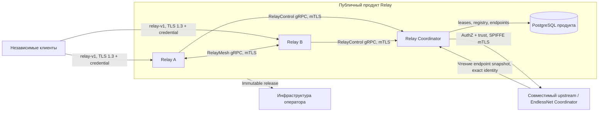
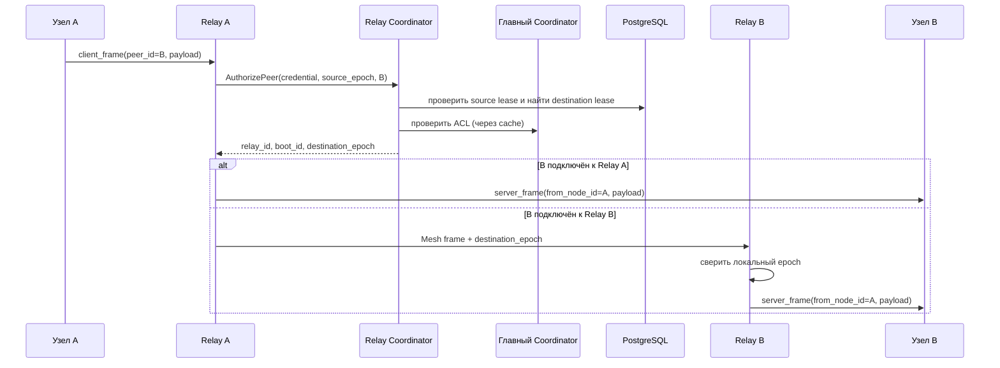

# Архитектура EndlessNet Relay

Статус: архитектурная модель самостоятельного продукта, обновлена 7 сентября 2026 года.
Проверка реализации и CI фиксируется отдельно; принятие модели не означает завершения приёмки.

## 1. Назначение и границы

EndlessNet Relay передаёт непрозрачные кадры между узлами одной авторизованной сети,
когда прямое соединение между ними недоступно или не выбрано. Репозиторий
владеет двумя production-компонентами:

- **Relay** — публичный data plane, клиентские сессии и mesh-соединения с
  другими relay;
- **Relay Coordinator** — control plane relay-кластера: регистрация
  экземпляров, аренда и fencing сессий, поиск текущего владельца узла,
  авторизация и публикация списка публичных endpoint.

Relay является самостоятельным публичным продуктом согласно
[D-032](https://github.com/endless-net/architecture/blob/main/docs/ru/decisions/d-032.md).
Совместимый upstream владеет сетями, узлами, направленными ACL и signing trust.
Relay Coordinator обращается к нему через [опубликованный контракт](upstream-contract.md)
и хранит короткоживущий кэш. EndlessNet Coordinator является интегратором;
его текущая совместимость (R1) требует отдельной проверки в его репозитории.
Исходники, БД, CI и production-конфигурация других компонентов не нужны продукту.

Сервис намеренно не является:

- хранилищем или брокером с гарантированной доставкой;
- источником истины для ACL и членства узлов;
- обработчиком содержимого пользовательского payload;
- общим L7-прокси.

## 2. Контекст системы



Payload проходит только через Relay и relay mesh. Relay Coordinator и главный
Coordinator получают credential, идентификаторы сети и узлов, но не получают
пользовательский payload.

## 3. Компоненты

| Компонент | Ответственность | Состояние |
| --- | --- | --- |
| `endlessnet-relay` | Публичный TLS listener, проверка credential, клиентские сессии, локальная и mesh-доставка, admission control, метрики | Сессии и очереди только в памяти |
| `endlessnet-relay-coordinator` | Регистрация relay, leases, fencing, маршрутизация, ACL, trust bundle, endpoint snapshot | PostgreSQL и короткоживущий кэш авторизации |
| Главный Coordinator | Сети, узлы, ACL, revocation, подписывающие ключи | Внешняя зависимость |
| PostgreSQL | Реестр relay, текущий владелец сессии узла, публичные endpoint | Выделенная база Relay Coordinator |
| `endlessnet-relay-smoke` | Проверка публичного TLS relay и HTTPS health Relay Coordinator | Запускается workflow или оператором |

## 4. Сетевые интерфейсы

| Интерфейс | По умолчанию | Защита | Назначение |
| --- | --- | --- | --- |
| Relay public | `:9443` | TLS 1.3 | Клиентский JSON-lines протокол v1 |
| Relay mesh | `:9444` | TLS 1.3 + взаимная аутентификация | Двунаправленный gRPC stream между relay |
| Relay Coordinator gRPC | `:9445` | TLS 1.3 + взаимная аутентификация | `RelayControl` для relay |
| Relay Coordinator HTTPS | `127.0.0.1:7078` | TLS 1.3 + SPIFFE mTLS | Endpoint snapshot; доступен главному Coordinator на том же хосте |
| Relay health/metrics | `127.0.0.1:9190` | Loopback | `/healthz`, `/readyz` и `/metrics` |
| Relay Coordinator health | `127.0.0.1:9191` | Loopback | `/healthz` и `/readyz` для systemd/deployment |

Если адрес метрик Relay выносится за loopback, его защиту должен обеспечить
сетевой периметр или локальный reverse proxy.

## 5. Основные потоки

### 5.1. Запуск Relay

1. Процесс получает публичный сертификат через systemd credential и
   динамическую workload identity через локальный SPIRE Workload API.
2. Для запуска обязательны стабильный `relay_id`, рекламируемый `mesh_addr` и
   адрес Relay Coordinator. `boot_id` уникален для процесса и генерируется,
   если не задан явно.
3. Relay по mTLS регистрирует пару `(relay_id, boot_id)` в Relay Coordinator.
4. В ответ получает lease экземпляра, актуальный trust bundle и список живых
   relay peers.
5. Только после получения валидного trust bundle запускаются публичный
   listener и mesh server.
6. Каждые 5 секунд Relay посылает heartbeat. Обновлённый список peers меняет
   набор исходящих mesh streams.
7. Если lease экземпляра истёк и связь не восстановилась в течение fencing
   grace, Relay закрывает все клиентские сессии.

Lease экземпляра по умолчанию действует 15 секунд. Heartbeat идёт каждые
5 секунд, дополнительный fencing grace также равен 5 секундам.

### 5.2. Установка клиентской сессии

1. Клиент устанавливает TLS 1.3 соединение с публичным Relay.
2. Первой строкой отправляет `client_hello` с `protocol_version = 1`,
   Ed25519 credential и, при необходимости, интервалом server heartbeat.
3. Relay строго декодирует JSON, отвергает неизвестные поля, лишнее JSON-значение,
   неверный тип сообщения или версию.
4. Relay проверяет подпись и срок credential по trust bundle.
5. Relay запрашивает у Relay Coordinator авторизацию credential и lease сессии.
6. Relay Coordinator сверяет credential с главным Coordinator и атомарно
   увеличивает `epoch` текущей пары `(network_id, node_id)` в PostgreSQL.
7. Relay возвращает `ready`. Предыдущая сессия того же узла становится
   неавторитетной и будет закрыта при следующей проверке lease.

Session lease по умолчанию действует 15 секунд и обновляется Relay каждые
5 секунд. Ошибка renewal закрывает соответствующую клиентскую сессию.

### 5.3. Передача кадра



Каждый кадр заново проходит проверку маршрута и ACL. Положительное решение
главного Coordinator кэшируется Relay Coordinator на 5 секунд и может быть
использовано до 30 секунд только при ошибке upstream. Отрицательное решение
кэшируется на 1 секунду и никогда не используется как stale-разрешение.

Кадр доставляется локально либо ровно через один mesh hop. `destination_epoch`
не позволяет старому процессу или старой сессии принять кадр после миграции
узла.

### 5.4. Переподключение и fencing

Идентичность владельца сессии состоит из:

```text
(network_id, node_id, relay_id, boot_id, epoch)
```

- новый процесс с тем же `relay_id`, но другим `boot_id`, блокирует heartbeat
  старого процесса;
- новый `AcquireSession` для того же `(network_id, node_id)` увеличивает
  `epoch`;
- renewal разрешён только точному текущему владельцу;
- mesh-доставка разрешена только при совпадении `destination_epoch`;
- `ReleaseSession` деактивирует запись при полном совпадении владельца,
  сохраняя последний epoch; более новую сессию старый release не изменяет.

Так устраняется split-brain на уровне сессии без распределённой блокировки в
самих Relay.

## 6. Контракты

### 6.1. Публичный relay-v1

Формат — одно JSON-сообщение на строку. Для всех сообщений обязательны
`type` и `protocol_version = 1`.

| Направление | Сообщение | Назначение |
| --- | --- | --- |
| Клиент → Relay | `client_hello` | Аутентификация и параметры heartbeat |
| Relay → клиент | `ready` | Сессия принята |
| Клиент → Relay | `client_frame` | `peer_id` и непрозрачный payload |
| Relay → клиент | `server_frame` | `from_node_id` и непрозрачный payload |
| Relay → клиент | `heartbeat` | Поддержание активности по запросу клиента |
| Relay → клиент | `error` | Отказ протокола, ACL, маршрута или ресурса |

Payload обязателен и ограничен 64 KiB до JSON/base64-кодирования. Relay не
анализирует, не сохраняет и не журналирует его содержимое.

Семантика доставки — best effort через ограниченные очереди в памяти:

- нет подтверждения доставки конечным узлом;
- нет повторной отправки после разрыва соединения;
- нет durable-очереди;
- медленный получатель отключается, когда его очередь заполнена;
- порядок сохраняется внутри одного активного socket writer, но не обещается
  между переподключениями или сменой Relay.

### 6.2. Credential и trust bundle

- алгоритм credential: `ed25519-relay-credential-v3`;
- подписываемая схема: версия 3;
- идентификатор ключа: SHA-256 от Ed25519 public key;
- credential связывает `network_id`, `node_id`, `key_id` и `expires_at`;
- trust bundle имеет версию 1, активный ключ и набор доверенных ключей;
- окна `not_before`/`not_after` позволяют безопасное перекрытие ключей при
  ротации.

Relay принимает credential только при известном ключе, валидной подписи,
неистёкшем сроке и положительном решении control plane.

### 6.3. Внутренний gRPC v1

Пакет `endlessnet.relay.v1` содержит:

- `RelayControl`: `RegisterInstance`, `HeartbeatInstance`, `AcquireSession`,
  `RenewSession`, `ReleaseSession`, `AuthorizePeer`;
- `RelayMesh.Connect`: двунаправленный stream с versioned `oneof` сообщениями
  `hello`, `frame`, `ping`, `pong`.

Неверная версия, пустой `oneof` или неизвестное protobuf-поле приводит к
закрытию RPC/stream. Серверные interceptors рекурсивно проверяют запросы, а
control и mesh клиенты так же проверяют все ответы.

### 6.4. Endpoint snapshot

Relay Coordinator загружает при старте строгий JSON следующего вида:

```json
{
  "version": 1,
  "endpoints": [
    {
      "id": "relay-region-a-1",
      "addr": "relay-region-a-1.example:9443",
      "protocol": "relay-v1-tls",
      "region": "region-a",
      "priority": 0
    }
  ]
}
```

Версия должна быть положительной и не может двигаться назад относительно
сохранённого snapshot. Дублирующиеся ID и неполные endpoint запрещены.
Snapshot доступен по `GET /internal/relay-control/v1/endpoints` только workload
с точной настроенной upstream identity (default
`spiffe://endlessnet.ru/service/coordinator`); token-only
запросы отклоняются.

## 7. Данные

| Таблица | Ключ | Назначение | Срок жизни |
| --- | --- | --- | --- |
| `relay_instances` | `relay_id` | Текущий boot, mesh address и lease Relay | Логически ограничен `lease_expires_at` |
| `node_session_leases` | `(network_id, node_id)` | Единственный текущий владелец и epoch сессии узла | Логически ограничен `lease_expires_at` |
| `platform_relay_snapshot` | `snapshot_key` | Версия текущего snapshot, включая пустой | До замены snapshot |
| `platform_relay_endpoints` | `endpoint_id` | Содержимое текущего snapshot публичных Relay | До замены snapshot |

Истёкшие строки не участвуют в маршрутизации, но сейчас не удаляются отдельным
фоновым процессом. Миграции встроены в бинарник и применяются при старте.
Согласно правилам проекта новые миграции не должны добавлять `DEFAULT`, явный
`NOT NULL` или PostgreSQL foreign keys.

## 8. Безопасность

### 8.1. Каналы и workload identity

Ниже указаны defaults EndlessNet. Оператор задаёт собственный trust domain
и service identities согласно [контракту](upstream-contract.md). Это не добавляет
альтернативные identities в allowlist; политика заменяется целиком.

- публичный Relay всегда использует TLS 1.3;
- Relay → Relay Coordinator использует mTLS; клиентский сертификат обязан
  содержать единственный URI SAN `spiffe://endlessnet.ru/relay/{relay_id}`;
- relay mesh использует mTLS и точное соответствие того же URI SAN заявленному
  `relay_id` с обеих сторон;
- Relay Coordinator → главный Coordinator использует клиентскую identity
  `spiffe://endlessnet.ru/service/relay-coordinator` и ожидает серверную identity
  `spiffe://endlessnet.ru/service/coordinator`;
- Relay ожидает у Relay Coordinator серверную identity
  `spiffe://endlessnet.ru/service/relay-coordinator`;
- SPIRE выдаёт SVID только dedicated systemd units по точным selectors; shared
  service token и статические internal certificate/key файлы не используются.

Production Relay и тестовая fixture всегда запускают настоящий TLS 1.3 data
path. Plaintext и standalone fallback отсутствуют.

### 8.2. Fail-closed поведение

- неизвестная версия, тип или поле публичного протокола отклоняется;
- недоступность trust bundle не позволяет открыть публичный listener;
- недоступность Relay Coordinator не позволяет авторизовать новый кадр;
- потеря session lease закрывает сессию;
- потеря instance lease в итоге fence-ит весь Relay;
- неизвестный или устаревший mesh peer/boot/epoch отклоняется;
- ACL denial не раскрывает клиенту внутреннюю причину решения.

Допущение по доступности существует только внутри кэша Relay Coordinator:
недавнее положительное решение может жить до 30 секунд при временной ошибке
главного Coordinator. Это ограниченное stale-while-error окно, а не
неограниченный fail-open.

## 9. Ограничение ресурсов

| Механизм | Значение по умолчанию | Реакция |
| --- | --- | --- |
| Все клиентские соединения | 4096 на процесс | Новое соединение закрывается до запуска goroutine |
| Соединения от одного source | 32 | Новое соединение закрывается |
| Одновременная аутентификация | 128 | Load shedding без дополнительной TLS-записи |
| Неаутентифицированное соединение | timeout 10 секунд | Ошибка и закрытие |
| Очередь клиенту | 64 кадра | Медленный клиент отключается |
| Mesh-очередь на peer | 256 сообщений | Новый кадр отклоняется |
| Payload | 64 KiB | Кадр отклоняется |
| Входящая полоса сессии | Не ограничена по умолчанию | При включённом лимите нарушитель отключается |

Лимиты соединений и аутентификации общие для всех listeners одного процесса.
Полосовой лимит — простой секундный window на одну клиентскую сессию.

## 10. Отказы и восстановление

| Событие | Текущее поведение |
| --- | --- |
| Перезапуск Relay | Новый `boot_id`; старый процесс fence-ится, клиенты переподключаются |
| Миграция узла на другой Relay | Новый `epoch`; старый владелец не может renew или принять mesh frame |
| Потеря mesh stream | Peer помечается недоступным; reconnect с backoff от 1 до 10 секунд |
| Переполнение очереди mesh | Исходный Relay возвращает клиенту ошибку, если enqueue не состоялся локально |
| Отказ доставки на удалённом Relay | Mesh остаётся fire-and-forget; исходный Relay не получает end-to-end подтверждения удалённой доставки |
| Отказ Relay Coordinator | Новые авторизации не проходят; session renewal закрывает активные сессии; instance lease ограничивает жизнь процесса |
| Отказ главного Coordinator | Работает только ограниченный положительный stale cache; после окна авторизация закрывается |
| Отказ PostgreSQL | Control RPC и readiness Relay Coordinator перестают быть успешными |
| SIGTERM | Relay прекращает приём и закрывает сессии/mesh; graceful gRPC shutdown ограничен 5 секундами, затем Stop |

Автономный E2E поднимает PostgreSQL, управляемый upstream, SPIRE Server/Agents,
Relay Coordinator и три Relay из одного SHA. Используются production binaries,
настоящий Workload API и независимые сетевые клиенты. GitHub-hosted CI разделён
на verify, storage и группы protocol/auth, SPIFFE/mesh, fencing/recovery,
resources/lifecycle; отдельный запуск проверяет пользовательский trust domain.
Отсутствие рабочего стенда — ошибка setup. Ручной extended run длится 30 минут.
Результат отдельного запуска не подтверждает интеграцию основного Coordinator.

## 11. Наблюдаемость

Relay пишет структурированные JSON-логи в stderr и отдаёт Prometheus text
format на `/metrics`. Основные группы метрик:

- активные/всего соединения и причины admission rejection;
- активные аутентификации;
- активные/всего/revoked сессии;
- входящие и исходящие кадры и байты;
- drops по причинам `invalid`, `no_peer`, `write_failed`, `slow_consumer`,
  `bandwidth`, `acl`;
- heartbeat и draining state.

Идентификаторы и содержимое payload в метрики не попадают.

Текущая семантика probes:

- Relay `/healthz` подтверждает только работу локального HTTP server;
- Relay `/readyz` требует listener, действующий instance lease, пригодный активный
  signing key и отсутствие fencing/draining; отказ одного mesh peer не отключает узел;
- Relay Coordinator `/healthz` является liveness;
- Relay Coordinator `/readyz` проверяет чтение endpoint snapshot из БД, но не
  доступность главного Coordinator, trust bundle или способность обслужить
  полный control flow.

Отдельных метрик Relay Coordinator, mesh-соединений и latency control RPC пока
нет.

## 12. Конфигурация

### 12.1. Relay

Обязательная production-конфигурация:

- `ENDLESSNET_RELAY_ID` / `--relay-id`;
- `ENDLESSNET_RELAY_MESH_ADDR` / `--mesh-addr`;
- `ENDLESSNET_RELAY_COORDINATOR_ADDR` / `--relay-coordinator-addr`;
- публичные certificate/key;
- локальный SPIRE Workload API (штатно
  `unix:///run/spire/sockets/agent.sock`).

Дополнительно задаются public/mesh/metrics listen addresses, `boot_id`, admission
limits и per-session bandwidth limit. Флаги имеют приоритет над environment
variables. Bandwidth limit и admission limits сейчас задаются только флагами.

### 12.2. Relay Coordinator

Обязательны:

- DSN выделенного PostgreSQL;
- HTTPS URL главного Coordinator;
- путь к versioned endpoint snapshot;
- локальный SPIRE Workload API.

Endpoint snapshot читается только при старте; hot reload сейчас отсутствует.

## 13. Выпуск и размещение

Relay публикует immutable artifact после собственных CI/E2E и не входит в server
release set EndlessNet. Producer workflows не вызывают Infrastructure rollout.
Оператор самостоятельно закрепляет артефакт и размещает продукт.
EndlessNet Infrastructure владеет своей топологией, rollout и интеграционной
приёмкой. Общая инструкция [self-hosting](systemd-deployment.md) принадлежит Relay.

## 14. Известные ограничения

- один активный Relay Coordinator process является точкой отказа control plane;
- полный mesh требует O(N²) streams;
- каждый кадр синхронно зависит от `AuthorizePeer`, пусть и с upstream cache;
- очереди и доставка не durable, end-to-end acknowledgment отсутствует;
- удалённая mesh-доставка не имеет end-to-end acknowledgment;
- endpoint snapshot меняется только через перезапуск Relay Coordinator;
- startup migrations не имеют отдельного журнала версий или распределённой
  блокировки;
- readiness и метрики покрывают не все критические зависимости.

Варианты закрытия этих ограничений описаны в [возможном будущем](future.md).

## 15. Инварианты исправлений R2–R6

- Exact peer identity извлекается из проверенного SVID, включая SPIFFE callback,
  который не заполняет `VerifiedChains`; relay_id должен совпадать с сертификатом.
- `--trust-domain`, `--coordinator-identity`, `--upstream-identity` задают единую
  политику control/mesh/snapshot. Defaults сохранены, расширение доверия запрещено.
- Release сохраняет неактивную строку и последний epoch. Acquire увеличивает epoch
  атомарно; переполнение приводит к отказу. Старый release не меняет нового владельца.
- Renewal не возобновляет expired/released session. Resolve проверяет обе аренды и boot.
- Входящий stream требует boot из текущего snapshot; смена boot закрывает stream,
  состояние проверяется повторно на каждом frame.
- Heartbeat имеет deadline 5 секунд. Независимый watchdog ограничивает жизнь
  экземпляра сроком instance lease плюс grace, затем выключает listener и mesh.
- Local и remote overflow закрывают медленного получателя и учитываются одинаково.
  Best-effort delivery, форматы credential и relay-v1 сохранены.
- Credential expiry и stale cache проверяются после завершения upstream-вызова.
